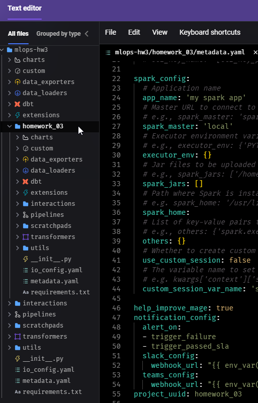

```markdown
# Homework 3 Report

## Overview

This report details the steps taken to complete Homework 3, which involves creating a data pipeline using Mage, preparing data, and training a machine learning model.

## Steps and Screenshots

### Step 1: Setup Docker and Mage

I started Docker Desktop and then, in PowerShell (Windows terminal), I ran the following command to start Mage:
```sh
docker run -it -p 6789:6789 -v ${PWD}:/home/src mageai/mageai /app/run_app.sh mage start mlops-hw3
```
Mage version used: **v0.9.71**

**Screenshot:**


### Step 2: Create a New Project

1. I navigated to `localhost:6789` and opened the Text Editor.
2. Right-clicked on the file explorer and selected “New Mage Project”.
3. Created a new project named `homework_03`.

**Screenshots:**




### Step 3: Create a Pipeline

I created a pipeline for the project `homework_03`.

**Screenshot:**


### Step 4: Ingest Data

I created a data loader block named `Ingest` to read the March 2023 Yellow taxi trips data.

```python
import requests
from io import BytesIO
from typing import List
import pandas as pd

if 'data_loader' not in globals():
    from mage_ai.data_preparation.decorators import data_loader

@data_loader
def ingest_files(**kwargs) -> pd.DataFrame:
    dataset_trips_2023_march = "https://d37ci6vzurychx.cloudfront.net/trip-data/yellow_tripdata_2023-03.parquet"
    response = requests.get(dataset_trips_2023_march)
    
    if response.status_code != 200:
        raise Exception(response.text)
    
    df = pd.read_parquet(BytesIO(response.content))
    return df
```

**Screenshots:**


### Step 5: Data Preparation

I created a transformer block for data preparation with the previous block as its parent. The transformation includes calculating the trip duration and converting categorical columns to string type.

```python
import pandas as pd

@transformer
def transform_dataframe(df):
    df.tpep_dropoff_datetime = pd.to_datetime(df.tpep_dropoff_datetime)
    df.tpep_pickup_datetime = pd.to_datetime(df.tpep_pickup_datetime)
    df['duration'] = (df.tpep_dropoff_datetime - df.tpep_pickup_datetime).dt.total_seconds() / 60
    df = df[(df.duration >= 1) & (df.duration < 60)]
    categorical = ['PULocationID', 'DOLocationID']
    df[categorical] = df[categorical].astype(str)
    return df
```

**Screenshots:**


### Step 6: Train a Linear Regression Model

I created another transformer block to train a linear regression model. The model uses pickup and dropoff locations as features and trip duration as the target.

```python
import pandas as pd
from sklearn.feature_extraction import DictVectorizer
from sklearn.linear_model import LinearRegression

@transformer
def transform(df):
    categorical_columns = ['PULocationID', 'DOLocationID']
    target = 'duration'
    
    for col in categorical_columns:
        df[col] = df[col].astype('category')
    
    X = df[categorical_columns]
    y = df[target]
    
    dv = DictVectorizer(sparse=True)
    X_train = dv.fit_transform(X.to_dict(orient='records'))
    
    lr = LinearRegression()
    lr.fit(X_train, y)
    
    print("Intercept:", lr.intercept_)
    return dv, lr
```

**Screenshots:**


## Results

The intercept of the linear regression model is **24.77**.

This completes the steps and outputs for Homework 3. The pipeline successfully ingests, transforms the data, and trains a linear regression model.
```